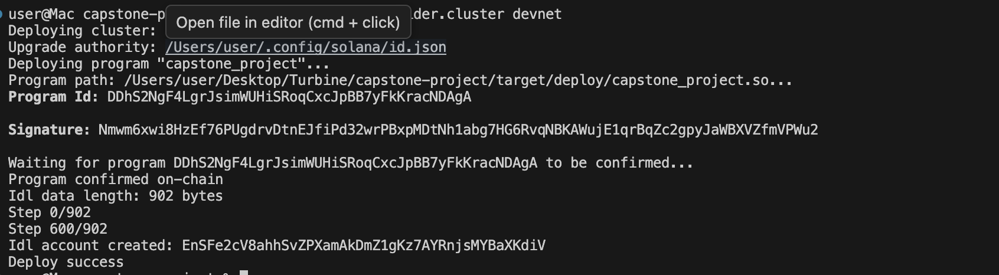
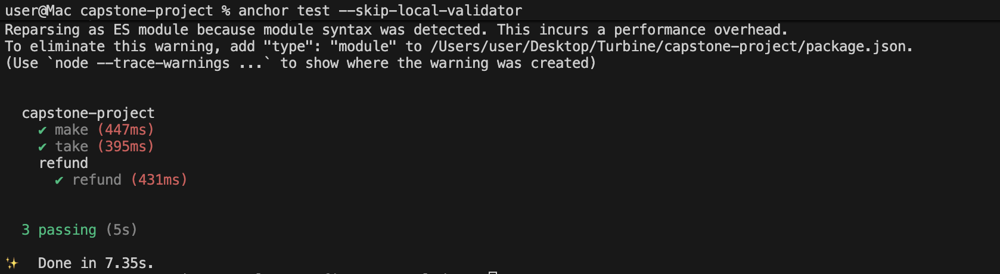

Program ID - DDhS2NgF4LgrJsimWUHiSRoqCxcJpBB7yFkKracNDAgA
Signature: Nmwm6xwi8HzEf76PUgdrvDtnEJfiPd32wrPBxpMDtNh1abg7HG6RvqNBKAWujE1qrBqZc2gpyJaWBXVZfmVPWu2

Deployment Screenshot: 
Test Screenshot: 

Escrow Constraint Logic Documentation

    A time-based restriction is enforced on the escrow vault using a stored deadline . This deadline determines who has authority over the locked funds at any given moment.

    When the escrow is created, one party deposits a specified amount of tokens into a vault account controlled by the program. After this deposit is made, the depositor no longer has direct access to the funds. The vault is governed strictly by program rules and cannot be withdrawn from arbitrarily.

    Before the deadline:

    * The designated counterparty may claim the locked tokens  and the claim will only succeed if all required conditions are met for any defined exchange requirement.
    * The original depositor cannot withdraw the funds during this period.

    At or before the exact deadline timestamp, only the claim operation is valid. The depositor remains blocked from recovering funds.

    After the deadline has passed:

    * The claim operation becomes permanently invalid.
    * The designated counterparty can no longer access the vault.
    * The original depositor becomes eligible to withdraw and recover the initial deposit.

    The deadline passing does not automatically return the funds. The escrow simply transitions into an expired state. The depositor must explicitly invoke the withdrawal instruction to reclaim the locked tokens. Until that action is taken, the escrow account remains on-chain but inactive.

    Time Partition Summary

    * Before deadline: Only the counterparty can complete the claim if requirements are satisfied.
    * After deadline: Only the depositor can recover the funds.